# Documentación Técnica - Calendary WhatsApp

## Descripción General

Sistema de agendamiento escolar automatizado vía WhatsApp que permite a padres de familia agendar citas con docentes. Integra inteligencia artificial para procesamiento de lenguaje natural y Google Sheets como base de datos.

---

## Stack Tecnológico

| Componente | Tecnología | Versión |
|------------|------------|---------|
| **Runtime** | Node.js | 18+ |
| **Framework Bot** | @builderbot/bot | 1.3.14 |
| **Provider WhatsApp** | @builderbot/provider-baileys | 1.3.14 |
| **IA/LLM** | Groq (Llama 3) | SDK 0.25.0 |
| **Base de Datos** | Google Sheets API | v4 |
| **Calendario** | Google Calendar API | v3 |
| **Autenticación** | Google Service Account | OAuth2 |

---

## Arquitectura del Sistema

```mermaid
flowchart TB
    subgraph WhatsApp["📱 WhatsApp"]
        User[Usuario]
    end
    
    subgraph Bot["🤖 Bot Server"]
        App[app.js]
        AIChat[ai-chat.js]
        Google[googleService.js]
        ChatHistory[chat-history.js]
        Scheduler[scheduled-messages.js]
    end
    
    subgraph External["☁️ Servicios Externos"]
        Groq[Groq AI]
        Sheets[Google Sheets]
        Calendar[Google Calendar]
    end
    
    User <--> App
    App --> AIChat
    App --> Google
    App --> ChatHistory
    App --> Scheduler
    AIChat --> Groq
    Google --> Sheets
    Google --> Calendar
    Scheduler --> Google
```



---

## Módulos del Sistema

### 1. app.js - Punto de Entrada

**Responsabilidad:** Inicialización del bot, enrutamiento de mensajes, endpoints HTTP.

```mermaid
flowchart LR
    A[Mensaje entrante] --> B{¿Blacklist?}
    B -->|Sí| C[Ignorar]
    B -->|No| D{¿Intención cita?}
    D -->|Sí| E[ai-chat.js]
    D -->|No| F{¿Flujo Sheets?}
    F -->|Sí| G[Respuesta + Media]
    F -->|No| H[IA General]
```



**Funciones principales:**
- `dynamicFlow` - Procesa todos los mensajes entrantes
- `main()` - Inicializa servicios y scheduler
- Endpoints: `/v1/messages`, `/v1/blacklist`

---

### 2. ai-chat.js - Motor de Conversación IA

**Responsabilidad:** Gestión de flujos conversacionales, agendamiento de citas, interacción con Groq AI.

**Estados del flujo de citas:**


**Clases principales:**
- `GroqService` - Comunicación con Groq AI
- `continueAppointmentFlow()` - Máquina de estados del agendamiento

---

### 3. googleService.js - Integración Google

**Responsabilidad:** CRUD con Google Sheets y Calendar.

**Hojas de Sheets gestionadas:**

| Hoja | Propósito |
|------|-----------|
| `Flujos` | Respuestas automáticas por palabra clave |
| `IA_Prompts` | Configuración del prompt del sistema |
| `Estudiantes` | Registro de estudiantes y docentes asignados |
| `Docentes` | Información de docentes, horarios, links Meet |
| `Citas_Registradas` | Historial de citas agendadas |
| `Configuracion_Formulario` | Campos dinámicos del formulario |
| `BlackList` | Números bloqueados |
| `Envios` | Mensajes programados |

**Funciones clave:**
- `getDocentes()` / `getStudentById()`
- `createEvent()` - Crea evento en Google Calendar
- `saveAppointmentToSheet()` - Registra cita
- `getDocenteAvailableHours()` - Disponibilidad real del calendario

---

### 4. chat-history.js - Persistencia de Contexto

**Responsabilidad:** Almacena historial de conversaciones en archivos JSON para mantener contexto entre mensajes.

**Estructura de archivos:**
```
bot_sessions/
├── 573001234567/
│   ├── history.json      # Historial de mensajes
│   └── appointment.json  # Estado del agendamiento
```

**Funciones principales:**
- `getHistory(phone)` / `saveMessage(phone, role, content)`
- `getAppointmentSession()` / `saveAppointmentSession()`
- `cleanOldHistories()` - Limpieza automática (24h)

---

### 5. scheduled-messages.js - Mensajes Programados

**Responsabilidad:** Envío automático de mensajes según fecha/hora programada.

```mermaid
flowchart TD
    A[Scheduler cada 60s] --> B{¿Horario permitido?}
    B -->|No| A
    B -->|Sí| C{¿Límite diario OK?}
    C -->|No| A
    C -->|Sí| D[Obtener mensajes pendientes]
    D --> E{¿Hora <= ahora?}
    E -->|No| A
    E -->|Sí| F[Enviar con delay aleatorio]
    F --> G[Actualizar Estado = Enviado]
    G --> A
```



**Protecciones anti-bloqueo:**
| Protección | Valor |
|------------|-------|
| Delay entre mensajes | 5-15s aleatorio |
| Límite diario | 50 mensajes |
| Ventana horaria | 6am - 9pm |
| Tracking de estado | Pendiente/Enviado/Error |

---

## Flujo Completo de Agendamiento

```mermaid
sequenceDiagram
    participant U as Usuario
    participant B as Bot
    participant AI as Groq AI
    participant G as Google Sheets
    participant C as Google Calendar
    
    U->>B: "Quiero agendar cita"
    B->>U: "Ingresa ID del estudiante"
    U->>B: "12345"
    B->>G: getStudentById(12345)
    G-->>B: {nombre, grado, docentes}
    B->>U: "Docentes: 1. María 2. Juan"
    U->>B: "1"
    B->>G: getDocenteModalidades("María")
    B->>U: "¿Virtual o Presencial?"
    U->>B: "Virtual"
    B->>G: getDocenteAvailableDates()
    B->>U: "Fechas: 1. Lunes 16 2. Miércoles 18"
    U->>B: "1"
    B->>C: getDocenteAvailableHours()
    B->>U: "Horarios: 02:00 PM, 03:00 PM"
    U->>B: "2 PM"
    B->>U: "¿Nombre del acudiente?"
    U->>B: "Carlos Pérez"
    B->>C: createEvent()
    B->>G: saveAppointmentToSheet()
    B->>U: "✅ Cita confirmada + Link Meet"
```



---

## Configuración de Entorno (.env)

```env
# WhatsApp
PORT=3010

# Google APIs
GOOGLE_APPLICATION_CREDENTIALS_JSON={"type":"service_account",...}
SHEET_ID=abc123...
CALENDAR_ID=email@group.calendar.google.com

# IA
GROQ_API_KEY=gsk_...
```

---

## Estructura de Directorios

```
calendary-whatsapp/
├── src/
│   ├── app.js                 # Punto de entrada
│   ├── ai-chat.js             # Motor IA y flujo de citas
│   ├── googleService.js       # Integración Google
│   ├── chat-history.js        # Persistencia de contexto
│   └── scheduled-messages.js  # Mensajes programados
├── bot_sessions/              # Historiales por usuario
├── package.json
├── .env
└── DOCUMENTACION.md
```

---

## API Endpoints

| Método | Endpoint | Descripción |
|--------|----------|-------------|
| POST | `/v1/messages` | Enviar mensaje manual |
| POST | `/v1/blacklist` | Agregar/remover de blacklist |

**Ejemplo envío manual:**
```bash
curl -X POST http://localhost:3010/v1/messages \
  -H "Content-Type: application/json" \
  -d '{"number":"573001234567","message":"Hola","urlMedia":""}'
```
