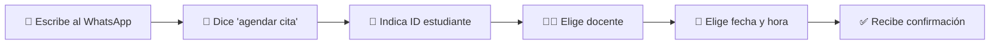
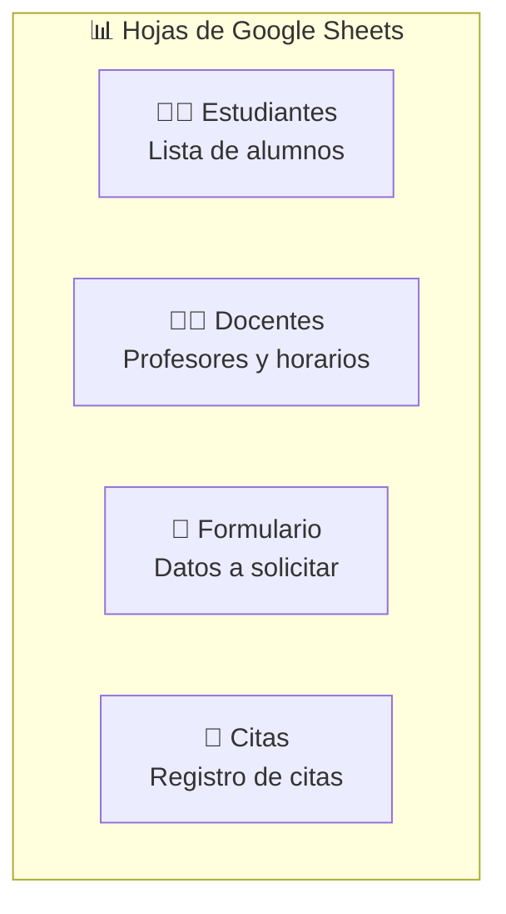
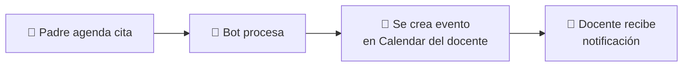
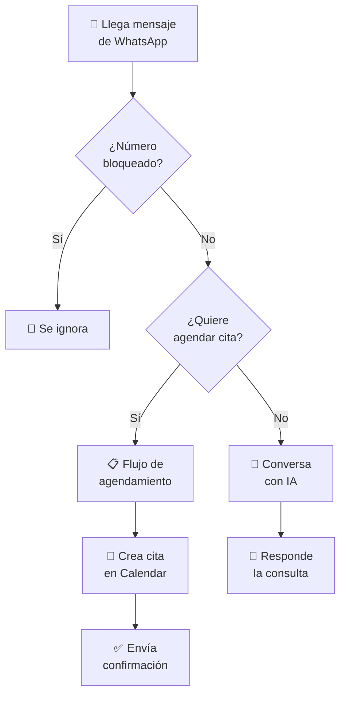
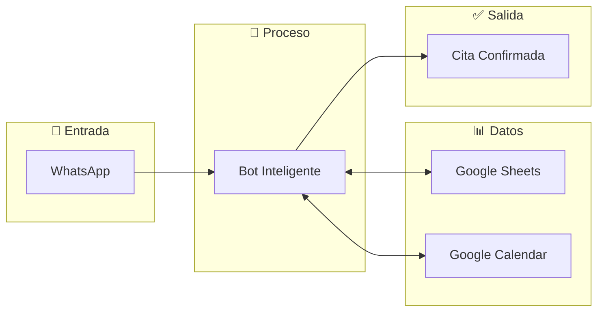

# 🎓 Sistema de Agendamiento de Citas Escolares

## ¿Qué es este sistema?

Un **asistente virtual de WhatsApp** que permite a los padres de familia agendar citas con los docentes de sus hijos de manera fácil y rápida, sin necesidad de llamar o ir al colegio.

---

## 🎯 ¿Para quién es?

| Quién | Qué puede hacer |
|-------|-----------------|
| **Padres de familia** | Agendar, consultar y cancelar citas desde WhatsApp |
| **Administradores** | Configurar docentes, horarios y mensajes desde Google Sheets |
| **Docentes** | Ver sus citas en Google Calendar |

---

## ✨ Beneficios

- ✅ Disponible **24/7** (el bot nunca duerme)
- ✅ Sin instalación (funciona en WhatsApp normal)
- ✅ Fácil de administrar (todo se configura desde Excel/Google Sheets)
- ✅ Confirmación automática de citas
- ✅ Evita conflictos de horarios

---

## 📱 ¿Cómo funciona para el padre?



### Ejemplo de conversación:

```
👤 Padre: Hola, quiero hablar con el profesor de mi hijo

🤖 Bot: ¡Hola! Para agendar una cita, escribe 'agendar cita'.

👤 Padre: agendar cita

🤖 Bot: 📚 Indícame el número de identificación del estudiante.

👤 Padre: 123456

🤖 Bot: ✅ Estudiante: Juan Pérez - 5° Primaria
        Docentes disponibles:
        1. María García (Matemáticas)
        2. Carlos López (Ciencias)
        
        ¿Con cuál docente deseas la cita?

👤 Padre: 1

🤖 Bot: 📅 Fechas disponibles:
        1. Lunes 11 Dic
        2. Miércoles 13 Dic
        3. Viernes 15 Dic

👤 Padre: 1

🤖 Bot: ⏰ Horarios para Lunes 11 Dic:
        • 08:00
        • 09:00
        • 10:00

👤 Padre: 9

🤖 Bot: Perfecto. ¿Cuál es tu nombre completo?

👤 Padre: Roberto Pérez

🤖 Bot: ✅ Cita confirmada:
        📅 Lunes 11 Dic a las 09:00
        👨‍🏫 Con María García
        📍 Presencial
```

---

## ⚙️ ¿Cómo se administra?

Todo se configura desde **Google Sheets** (como Excel pero en línea):

### Hojas principales:



| Hoja | ¿Qué contiene? |
|------|----------------|
| **Estudiantes** | Nombres, IDs, cursos y docentes asignados |
| **Docentes** | Nombres, calendarios, días y horas disponibles |
| **Formulario** | Preguntas que hace el bot (nombre, email, etc.) |
| **Citas** | Todas las citas agendadas |

---

## 📅 Integración con Google Calendar

Cada cita se crea automáticamente en el calendario del docente:



---

## 🚫 Control de acceso

El sistema incluye una **lista negra** para bloquear números problemáticos:

- Si un número está en la lista negra, el bot **no responde**
- Se puede agregar o quitar números desde Google Sheets

---

## 🔄 Flujo general del sistema



---

## 📊 Resumen Visual



---

## ❓ Preguntas Frecuentes

### ¿Qué necesito para usarlo?
- Un número de WhatsApp para el bot
- Una cuenta de Google (para Sheets y Calendar)
- Conexión a internet

### ¿Puedo cambiar las preguntas que hace el bot?
Sí, todo se configura desde Google Sheets sin tocar código.

### ¿Qué pasa si el padre escribe algo diferente a "agendar cita"?
El bot usa inteligencia artificial para entender y guiar al padre hacia el agendamiento.

### ¿Se puede cancelar una cita?
Sí, el padre puede escribir "cancelar cita" y seguir las instrucciones.

---

## 🎉 Conclusión

Este sistema permite que los padres agenden citas con docentes de manera **fácil, rápida y sin complicaciones**, mientras que los administradores tienen control total desde Google Sheets.

**Sin aplicaciones adicionales, sin capacitaciones complejas, solo WhatsApp.**
